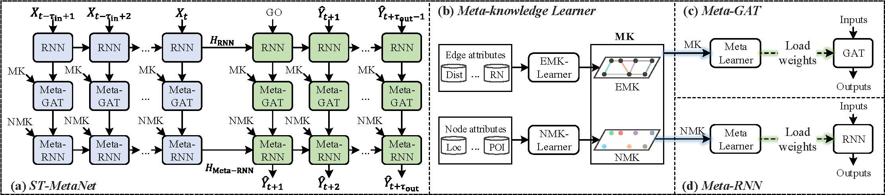

# ST-MetaNet: Urban Traffic Prediction from Spatio-Temporal Data  Using Deep Meta Learning



This is the MXNet implementation of ST-MetaNet in the following paper:

- Zheyi Pan, Yuxuan Liang, Weifeng Wang, Yong Yu, Yu Zheng, and Junbo Zhang. [Urban Traffic Prediction from Spatio-Temporal Data Using Deep Meta Learning](https://www.researchgate.net/publication/333186315_Urban_Traffic_Prediction_from_Spatio-Temporal_Data_Using_Deep_Meta_Learning). 2019. In The 25th ACM SIGKDD Conference on Knowledge Discovery and Data Mining (KDD'19), August 4–8, 2019, Anchorage, AK, USA.

---

## Requirements for Reproducibility

### System Requirements:

- System: Ubuntu 16.04
- Language: Python 3.5.2
- Devices: a single GTX 1080 GPU


### Library Requirements:

- scipy == 1.2.1
- numpy == 1.16.3
- pandas == 0.24.2
- mxnet-cu90 == 1.5.0b20190108
- dgl == 0.2
- tables == 3.5.1
- pymal
- h5py

Dependency can be installed using the following command:

`pip install -r requirements.txt`

After that, change the backend deep learning framework for dgl:
```bash
echo 'export DGLBACKEND=mxnet' >> ~/.bashrc
. ~/.bashrc
```

---

## Data Preparation

Unzip the data files in:

- `flow-prediction/data.zip`
- `traffic-prediction/data.zip` (the data is pre-processed in repository [DCRNN](https://github.com/liyaguang/DCRNN))

### Description of Flow Data

The flow data is collected from 32x32 grids of Beijing city.

- BJ_FEATURE.h5: the shape of data is (32, 32, 989), which indicates `(row, colume, feature_id)`. This data represents the node feature for each grid. It consists of POI features and road features saved in BJ_POI.h5 and BJ_ROAD.h5, respectively. 
- BJ_FLOW.h5: the shape of data is (150, 24, 32, 32, 2), which indicates `(date, hour, row, colume, flow_type)`. The `flow_type` represents inflow or outflow of the region. 
- BJ_GRAPH.h5: the shape is (1024, 1024, 32), which indicates `(grid_1, grid_2, feature_id)`. This data represents the edge feature from grid_1 to grid_2.
- BJ_POI.h5: POI features for each grid. This data is the intermediate output of preprocessing stage (not used in the model training & testing). 
- BJ_ROAD.h5: Road features for each grid. This data is the intermediate output of preprocessing stage (not used in the model training & testing). . 

### Description of Traffic Data

The description please refers to the repository of [DCRNN](https://github.com/liyaguang/DCRNN).

---

## Model Training & Testing

Given the flow prediction task as example (the traffic prediction task is exactly the same as the flow prediction task):

1. `cd flow-prediction/`.
2. The settings of the models are in the folder `src/model_setting`, saved as yaml format. Three models are provided: `seq2seq`, `gat-seq2seq`, and `st-metanet`. Other baselines refers to [DCRNN](https://github.com/liyaguang/DCRNN) and [ST-ResNet](https://github.com/lucktroy/DeepST/tree/master/scripts/papers/AAAI17), respectively.
3. All trained model will be saved in `param/`. There are two types of files in this folder:
   1. `model.yaml`: the model training log (the result on evaluation dataset of each epoch). This file records the number of the best epoch for the model.
   2. `model-xxxx.params`: the saved model parameters of the best evaluation epoch, where `xxxx` is the epoch number.
4. Running the codes:
   1. `cd src/` .
   2. `python train.py --file model_settting/[model_name].yaml --gpus [gpu_ids] --epochs [num_epoch]`. The code will firstly load the best epoch from `params/`, and then train the models for `[num_epoch]`. Our code can be trained with multiple gpus. An example of `[gpu_ids]` is `0,1,2,3` if you have four gpus. But we recommend to use a single gpu to train & evaluate the model if possible (currently, our implementation using DGL library for meta graph attention is not efficient when using multiple gpus). 
5. Training from the begining:
   1. Remove the model records in `param/`, otherwise the code will train from the best pre-trained (saved) model.
   2. Train the model (example).
      1. Single gpu: `python train.py --file model_setting/st-metanet.yaml --gpus 0 --epochs 200`. 
      2. Multiple gpu: `python train.py --file model_setting/st-metanet.yaml --gpus 0,1 --epochs 200`.
6. Testing the model (example): `python train.py --file model_setting/st-metanet.yaml --gpus 0 --epochs 0`. The code will directly give evaluation results on evaluation dataset and test dataset, without training.

---

## Citation

If you find this repository, e.g., the code and the datasets, useful in your research, please cite the following paper:

- Zheyi Pan, Yuxuan Liang, Weifeng Wang, Yong Yu, Yu Zheng, and Junbo Zhang. Urban Traffic Prediction from Spatio-Temporal Data Using Deep Meta Learning. 2019. In The 25th ACM SIGKDD Conference on Knowledge Discovery and Data Mining (KDD'19), August 4–8, 2019, Anchorage, AK, USA.

---

## License

ST-MetaNet is released under the MIT License (refer to the LICENSE file for details).